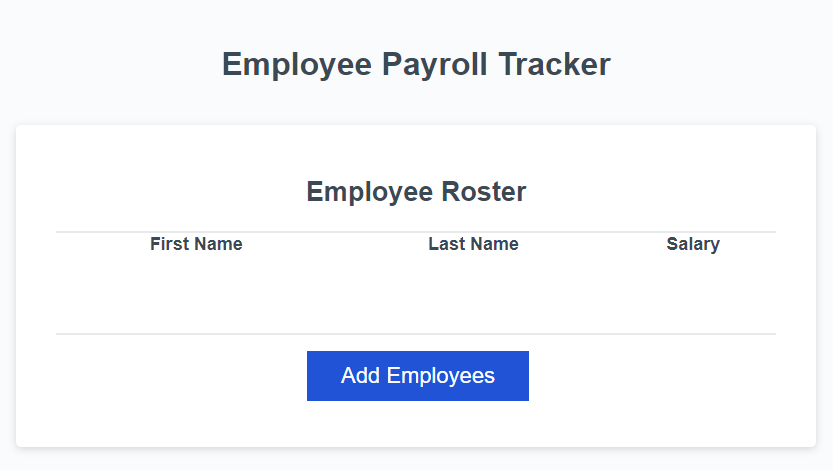
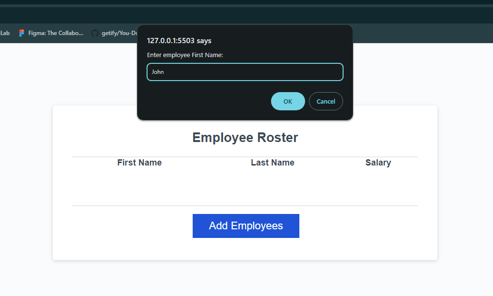
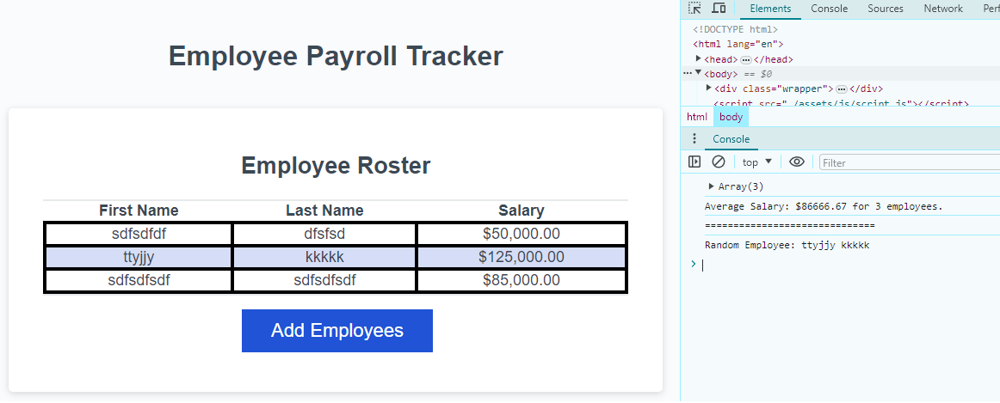

# JavaScript Challenge Module 3: Employee-Payroll-Tracker
## Description
This application keeps track of Employee Names and Salaries through user input. It also displays the average salary as well as a randomly selected employee through console log.

## User Story
```
AS A payroll manager

I WANT AN employee payroll tracker

SO THAT I can see my employees' payroll data and properly budget for the company
```

## Acceptance Criteria
```
GIVEN an employee payroll tracker

WHEN I click the "Add employee" button

THEN I am presented with a series of prompts asking for first name, last name, and salary

WHEN I finish adding an employee

THEN I am prompted to continue or cancel

WHEN I choose to continue

THEN I am prompted to add a new employee

WHEN I choose to cancel

THEN my employee data is displayed on the page sorted alphabetically by last name, and the console shows computed and aggregated data
```

## Technologies Used
I used a combination of HTML, CSS & JavaScript to create this application.

## Deployed Application
The application has been deployed [here](https://blitzbomber87.github.io/Employee-Payroll-Tracker/).

The user will first see an empty data sheet and a "Add Employees" button.


When they click on the button the will be prompted to type in Employee info for First & Last Name as well as salary.


When they click on either a movie poster or search result, they are shown a modal of movie information.


### Citations
Main Colaborator: Elias Ruiz - https://github.com/blitzbomber87
